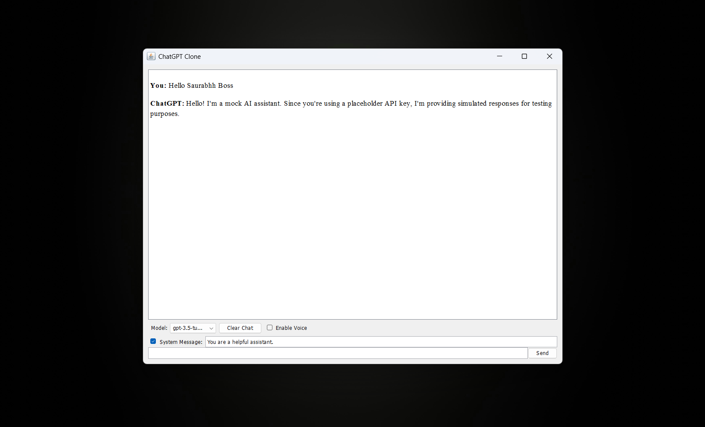

# ChatGPT Clone in Java with OpenAI API, UI, and Voice

This project demonstrates how to build a ChatGPT-like AI assistant using Java 17, OpenAI API, and a clean, modular approach. It provides a simple way to interact with OpenAI's GPT models through a Java application with both a console interface and a graphical user interface (GUI) with text-to-speech capabilities.

## Features

- Connect to OpenAI's GPT API using Java 17
- Send single questions or maintain conversation context
- Secure API key management (environment variables or properties file)
- Clean, modular code structure
- Simple console-based example application
- Graphical user interface (GUI) using Java Swing
- Text-to-speech functionality using FreeTTS
- Model selection (GPT-3.5-turbo, GPT-4)
- System message customization

## Project Structure

```
├── src/main/java/com/chatgpt/clone/
│   ├── config/
│   │   └── OpenAIConfig.java       # Configuration for API key and URL
│   ├── model/
│   │   ├── Message.java            # Message model for API requests
│   │   ├── ChatCompletionRequest.java  # Request model
│   │   └── ChatCompletionResponse.java # Response model
│   ├── service/
│   │   └── GPTService.java         # Main service for API communication
│   ├── ui/
│   │   ├── ChatGPTUI.java          # Graphical user interface
│   │   ├── VoiceManager.java       # Text-to-speech functionality
│   │   └── ChatGPTApp.java         # Main application launcher
│   ├── example/
│   │   └── GPTExample.java         # Console example usage
│   ├── util/
│   │   ├── Logger.java             # Logging utility
│   │   └── OpenAIUtil.java         # OpenAI utilities
│   └── exception/
│       └── OpenAIException.java    # Custom exception handling
├── config.properties.example       # Example configuration file
├── run-ui.bat                      # Batch file to run the UI
└── pom.xml                         # Maven dependencies
```

## Prerequisites

- Java 17 or higher
- Maven
- OpenAI API key

## Model Screenshot



## Setup

1. Clone this repository
2. Configure your OpenAI API key using one of these methods:
   - **Environment Variable**: Set `OPENAI_API_KEY` environment variable
     - Windows: `set OPENAI_API_KEY=your_api_key_here`
     - Linux/macOS: `export OPENAI_API_KEY=your_api_key_here`
   - **Properties File**: 
     - Copy `config.properties.example` to `config.properties`
     - Replace `YOUR_API_KEY_HERE` with your actual OpenAI API key
3. Build the project: `mvn clean install`

## Usage

### Basic Usage

```java
// Create a GPTService instance
GPTService gptService = new GPTService();

// Ask a simple question
String response = gptService.askQuestion("What is the capital of France?");
System.out.println(response);
```

### Conversation with Context

```java
// Create a list to hold the conversation
List<Message> conversation = new ArrayList<>();

// Add a system message to set the context
conversation.add(Message.systemMessage("You are a helpful assistant."));

// Add a user message
conversation.add(Message.userMessage("What is the capital of France?"));

// Get the response
String response = gptService.sendConversation(conversation);

// Add the assistant's response to the conversation
Message assistantMessage = Message.builder()
        .role("assistant")
        .content(response)
        .build();
conversation.add(assistantMessage);

// Continue the conversation
conversation.add(Message.userMessage("What is its population?"));
response = gptService.sendConversation(conversation);
System.out.println(response);
```

### Running the Examples

#### Console Example

The project includes a console example application that demonstrates both simple questions and interactive conversations:

```
mvn exec:java -Dexec.mainClass="com.chatgpt.clone.example.GPTExample"
```

#### Graphical User Interface

To run the graphical user interface with text-to-speech capabilities:

```
mvn exec:java -Dexec.mainClass="com.chatgpt.clone.ui.ChatGPTApp"
```

Or simply run the provided batch file:

```
run-ui.bat
```

The UI provides the following features:
- Chat with GPT models (GPT-3.5-turbo or GPT-4)
- Customize system messages
- Enable/disable text-to-speech
- Clear conversation history
- Visual display of conversation

## Customization

### Using Different Models

You can specify which GPT model to use:

```java
// Use GPT-4 instead of the default GPT-3.5-turbo
String response = gptService.askQuestion("What is quantum computing?", "gpt-4");
```

### Custom API Configuration

You can customize the API URL if needed:

```java
// Create a custom configuration
OpenAIConfig config = new OpenAIConfig("https://your-custom-endpoint.com/v1/chat/completions");
GPTService gptService = new GPTService(config);
```

## License

This project is licensed under the MIT License - see the LICENSE file for details.

## Acknowledgments

- [OpenAI API Documentation](https://platform.openai.com/docs/api-reference)
- [OkHttp](https://square.github.io/okhttp/) for HTTP requests
- [Jackson](https://github.com/FasterXML/jackson) for JSON processing

## Author

**Saurabh Kushwaha**  
🔗 [Portfolio](https://www.saurabhh.in)  
📧 Saurabh@wearl.co.in  
🔗 [LinkedIn](https://www.linkedin.com/in/saurabh884095/)  
🔗 [Instagram Dev Page](https://www.instagram.com/dev.wearl)

---

## License

This project is licensed under the [MIT License](LICENSE).

---

## Star this repo if you found it helpful!